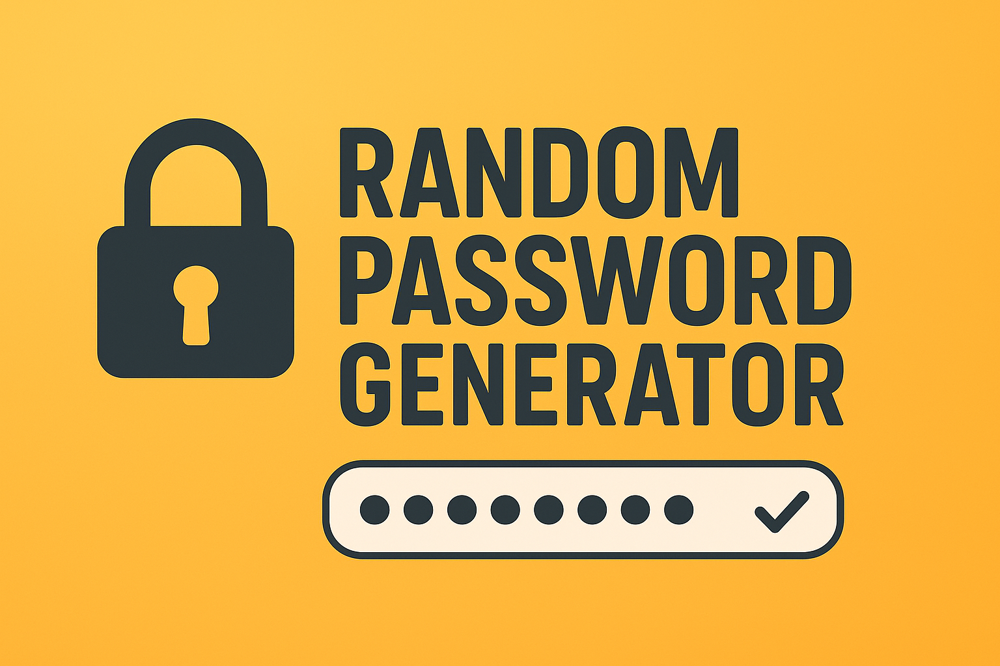

# 🔐 Random Password Generator  

  
  
  



*A simple web app to generate strong and secure random passwords of any length with just one click.* 

[**Checkout Random Password Generator Live**](https://password-generator-gaurav.vercel.app/)

---

## 📌 Overview
The **Random Password Generator** is a lightweight web application that helps users generate secure passwords instantly.  
It provides multiple options such as password length, inclusion of numbers, symbols, uppercase, and lowercase letters.  

✨ **Key Features:**
- 🔑 Generate strong random passwords  
- ⚙️ Choose custom password length  
- 🔢 Option to include numbers, symbols, uppercase & lowercase letters  
- 📋 One-click copy to clipboard  
- 📱 Clean and responsive UI  

---

## 🛠️ Tech Stack
- **Frontend:** HTML, CSS, JavaScript  

---

## 🚀 Getting Started  

### 🔧 Installation
Clone the repository:
```bash
git clone https://github.com/your-username/password-generator.git
```
Open the project folder:
```bash
cd password-generator
```

Run the app:
Just open index.html in your browser 🌍

---

📬 Contact

👤 Gaurav Kumar

LinkedIn: [Gaurav Kumar](https://www.linkedin.com/in/gaurav-kumar-25-oct?lipi=urn%3Ali%3Apage%3Ad_flagship3_profile_view_base_contact_details%3BW7%2FB5onwS4yNaZXl9gxzoA%3D%3D)

GitHub: @KumarGaurv007
